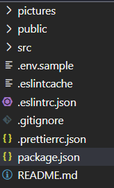

_Fork_ ce _boilerplate_ afin de démarrer le tutoriel : [https://github.com/bastienwcs/react-jwt-boilerplate](https://github.com/bastienwcs/react-jwt-boilerplate).



## 0 - Configuration

### Backend

Avant de démarrer, il faut que tu aies réalisé le tutoriel backend disponible ici : [https://github.com/bastienwcs/nodejs-jwt-boilerplate](https://github.com/bastienwcs/nodejs-jwt-boilerplate).

Il faut que le serveur backend soit exécuté en même temps que le serveur frontend (dans un onglet de terminal par exemple).

### Variable d'environnement

Dans le projet, copie le fichier `.env.sample` vers `.env` et modifie la variable d'environnement si nécessaire.

### Installation

Pense à installer le projet avec `npm install` avant de démarrer !

## 1 - Formulaire de connexion

La première étape consistera à créer un formulaire qui permettra à un utilisateur de se connecter au backend réalisé précédemment.

Ouvre le composant `Login` et crée un formulaire **contrôlé** contenant :

- un champ pour **email**
- un champ pour **password**
- un bouton permettant d'envoyer le formulaire

Crée une fonction `handleSubmit` liée à l'envoie du fomulaire :

- si l'email ou le mot de passe n'est pas renseigné, affiche une boîte d'alerte avec le message "Please specify both email and password"
- sinon, affiche la valeur des email et mot de passe avec un `console.log`

### Solution

> **Attention** : essaie de faire l'exercice par toi-même avant de regarder la solution !

-
-
-
-
-
-
-
-
-
-
-
-

```js
import React, { useState } from "react";

const Login = () => {
  const [email, setEmail] = useState("");
  const [password, setPassword] = useState("");

  const handleSubmit = () => {
    if (email && password) {
      console.log(email, password);
    } else {
      alert("Please specify both email and password");
    }
  };

  return (
    <form>
      <label htmlFor="email">
        Email:
        <input
          type="email"
          name="email"
          id="email"
          placeholder="test@blabla.com"
          value={email}
          onChange={(e) => setEmail(e.target.value)}
        />
      </label>
      <br />
      <label htmlFor="password">
        Password:
        <input
          type="password"
          name="password"
          id="password"
          placeholder="***********"
          value={password}
          onChange={(e) => setPassword(e.target.value)}
        />
      </label>
      <br />
      <button type="button" onClick={handleSubmit}>
        Login
      </button>
    </form>
  );
};

export default Login;
```

## 2 - Appel du serveur

Maintenant que ton formulaire est prêt, tu vas contacter le serveur afin qu'il te réponde si l'utilisateur est bien connecté.

Installe le module `axios` et modifie la fonction `handleSubmit` afin d'appeler la route `/login` de ton serveur, en utilisant la variable d'environnement. Tu trouveras comment appeler une variable d'environnement ici : [https://medium.com/better-programming/using-environment-variables-in-reactjs-9ad9c5322408](https://medium.com/better-programming/using-environment-variables-in-reactjs-9ad9c5322408) (dans la section _step 3_).

Pense que les _email_ et _password_ seront envoyé dans le corps de la requête, tu verras un exemple ici : [https://kapeli.com/cheat_sheets/Axios.docset/Contents/Resources/Documents/index](https://kapeli.com/cheat_sheets/Axios.docset/Contents/Resources/Documents/index) (dans la section _POST request_).

Si une erreur est récupérée, affiche une boîte d'alerte avec le message correspondant. Il s'agit de la méthode `catch` dont tu peux voir l'utilisation dans la ressource partagée juste avant.

Une fois le contenu de la réponse récupéré, affiche le résultat avec un `console.log`. Si le résultat ressemble au code suivant, c'est gagné :

```json
{
  "user": {
    "id": "son id",
    "email": "son email",
    "password": "hidden"
  },
  "token": "le token généré"
}
```

> Attention, vérifie bien que ton serveur backend est lancé !

### Solution

> **Attention** : essaie de faire l'exercice par toi-même avant de regarder la solution !

-
-
-
-
-
-
-
-
-
-
-
-

```js
const handleSubmit = () => {
  const { REACT_APP_SERVER_ADDRESS } = process.env;
  if (email && password) {
    axios
      .post(`${REACT_APP_SERVER_ADDRESS}/login/`, {
        email,
        password,
      })
      .then((res) => res.data)
      .then((data) => {
        console.log(data);
      })
      .catch((err) => {
        alert(err.response.data.errorMessage);
      });
  } else {
    alert("Please specify both email and password");
  }
};
```

## 3 - Sauvegarde du JSON Web Token

Maintenant que le JWT a bien été reçu, il va falloir le stocker lors de la connexion de l'utilisateur : c'est-à-dire au moment où tu fais actuellement le `console.log` du résultat de l'appel d'axios.

Utilise le **local storage** pour enregistrer dans la clé "TOKEN" la valeur de propriété `token` du JSON reçue.

Tu peux voir comment enregistrer une valeur dans le _local storage_ ici : [https://developer.mozilla.org/en-US/docs/Web/API/Storage/setItem](https://developer.mozilla.org/en-US/docs/Web/API/Storage/setItem).

Ensuite, affiche une boîte d'alerte avec le message "Logged successfully".

### Solution

> **Attention** : essaie de faire l'exercice par toi-même avant de regarder la solution !

-
-
-
-
-
-
-
-
-
-
-
-

```js
const handleSubmit = () => {
  const { REACT_APP_SERVER_ADDRESS } = process.env;
  if (email && password) {
    axios
      .post(`${REACT_APP_SERVER_ADDRESS}/login/`, {
        email,
        password,
      })
      .then((res) => res.data)
      .then((data) => {
        localStorage.setItem("TOKEN", data.token);
        alert("Logged successfully");
      })
      .catch((err) => {
        alert(err.response.data.errorMessage);
      });
  } else {
    alert("Please specify both email and password");
  }
};
```

## 4 - Page authentifiée : liste des utilisateurs

Passe maintenant dans le composant `Users`.

Le but de cette page est d'afficher la liste des utilisateurs.

La première étape va être de récupérer le "TOKEN" stocké dans le _local storage_. Tu trouvera ton bonheur ici :[https://developer.mozilla.org/en-US/docs/Web/API/Storage/getItem](https://developer.mozilla.org/en-US/docs/Web/API/Storage/getItem).

Ensuite, tu vas devoir modifier la fonction `useEffect` afin de faire un appel avec `axios` à la route `/users`. Cette route étant authentifiée par JWT, l'appel vas avoir besoin d'un **header** qui doit aura la forme suivante :

```js
{
  headers: {
    Authorization: `Bearer ${token}`,
  },
}
```

Tu trouveras comment envoyer des _headers_ avec _axios_ sur le lien suivant : [https://masteringjs.io/tutorials/axios/headers](https://masteringjs.io/tutorials/axios/headers). Fait en sorte de modifier l'exemple pour qu'il ressemble au code ci-dessus.

Si tout se passe bien, modifie le _state_ de `users` et la liste des utilisateurs devrait s'afficher.

S'il y a une erreur (dans la méthode `catch`), vérifie le _status code_ (`error.response.status`). S'il est égal à 403, cela veut dire que la personne n'est pas authentifiée. Afficher une boîte d'alerte avec le message "You're not authorized to access these datas". Si ce n'est pas ce code d'erreur, afficher le message d'erreur récupéré dans la réponse.

> Astuce : faire des `console.log` un peu partout pour t'aider si ça ne marche pas.

### Solution

> **Attention** : essaie de faire l'exercice par toi-même avant de regarder la solution !

-
-
-
-
-
-
-
-
-
-
-
-

```js
useEffect(() => {
  const { REACT_APP_SERVER_ADDRESS } = process.env;
  const token = localStorage.getItem("TOKEN");
  axios
    .get(`${REACT_APP_SERVER_ADDRESS}/users`, {
      headers: {
        Authorization: `Bearer ${token}`,
      },
    })
    .then((res) => res.data)
    .then((data) => {
      setUsers(data);
    })
    .catch((err) => {
      let message;
      if (err.response.status === 401) {
        message = "You're not authorized to access these datas";
      } else {
        message = err.response.data.errorMessage;
      }
      alert(message);
      console.error(err);
    });
}, []);
```

## 5 - Page authentifiée : liste des utilisateurs

Termine maintenant en allant dans le composant `Logout`.

Tu vas gérer la déconnexion de l'utilisateur en supprimant son "TOKEN" du _local storage_ : [https://developer.mozilla.org/en-US/docs/Web/API/Storage/removeItem](https://developer.mozilla.org/en-US/docs/Web/API/Storage/removeItem).

Une fois le _token_ supprimé, tu peux afficher une boîte d'alerte avec le message "Disconnected successfully".

**Bonus:** tu peux aussi créer un formulaire de création de compte pour t'entraîner.

### Solution

> **Attention** : essaie de faire l'exercice par toi-même avant de regarder la solution !

-
-
-
-
-
-
-
-
-
-
-
-

```js
const handleSubmit = () => {
  localStorage.removeItem("TOKEN");
  alert("Disconnected successfully");
};
```
